# VranceFlex SEO Site Architecture

Updated: 2026-08-31  
Canonical domain: `https://vranceflex.online`  
Site model: Hybrid SaaS acquisition site + private product workspace  
Primary language: English

## Executive direction

VranceFlex should operate as two deliberately separate information systems:

1. **A crawlable public acquisition site** that explains agent-led prospect research, verified prospect credits, human-approved outreach, recurring scheduling and BYOK delivery.
2. **A private application** for campaigns, leads, replies, billing, integrations and team administration. These routes must remain accessible to users but excluded from search indexes.

The architecture stays within three clicks of the homepage, uses short lowercase URLs, and avoids publishing templated SEO pages before each page has genuine product evidence, examples and editorial review.

## Current indexable release

The repository now implements the complete approved public architecture: the homepage, Product, Solutions, Integrations, Pricing, Demo, Resources and guides, Glossary, Trust, Security, Company, About, Contact, Privacy, Terms, evidence-based product comparisons, and controlled-switch alternative guides. Every published route has unique metadata, a canonical URL, an inbound link, and—below the hub level—a visible breadcrumb with `BreadcrumbList` structured data.

`/customers` exists as a transparent evidence gate with `noindex` until real customer-approved outcomes are available. Comparison routes are now published from a centralized, source-dated competitor dataset. Each page discloses VranceFlex ownership, links to official vendor sources, states who should choose the competing product, and omits unapproved switcher testimonials.

Authentication and product-workspace routes remain absent from the sitemap. The repository produces `/sitemap.xml` and `/robots.txt` through Next.js metadata routes, and middleware adds an HTTP `X-Robots-Tag` to private and authentication pages.

## Recommended public hierarchy

Legend: **[Live]** exists now, **[P1]** should be built first, **[P2]** follows after product proof exists, and **[Conditional]** must not ship without verified source material.

```text
Homepage (/) [Live]
├── Product (/product) [P1]
│   ├── Market & ICP Research (/product/market-research) [P1]
│   ├── Lead Discovery & Verification (/product/lead-verification) [P1]
│   ├── Eve Personalization (/product/eve-personalization) [P1]
│   ├── Human Approval Controls (/product/human-approval) [P1]
│   └── Recurring Outreach Scheduling (/product/recurring-schedules) [P1]
├── Solutions (/solutions) [P1]
│   ├── Founders & Small Businesses (/solutions/founders) [P1]
│   ├── Agencies & Fractional GTM Teams (/solutions/agencies) [P1]
│   └── Revenue Operations Teams (/solutions/revenue-operations) [P2]
├── Integrations (/integrations) [P1]
│   ├── Parallel Lead Research (/integrations/parallel) [P1]
│   ├── Resend Email Delivery (/integrations/resend) [P1]
│   └── Twilio SMS Delivery (/integrations/twilio) [P1]
├── Pricing (/pricing) [Live]
├── Demo (/demo) [Live]
├── Resources (/resources) [P2]
│   ├── Guides (/resources/guides) [P2]
│   │   ├── Build an Evidence-Backed B2B ICP (/resources/guides/b2b-icp) [P2]
│   │   ├── Verify B2B Leads Before Outreach (/resources/guides/lead-verification) [P2]
│   │   ├── Human-Approved Outreach Workflows (/resources/guides/human-approved-outreach) [P2]
│   │   ├── Recurring Outreach Campaigns (/resources/guides/recurring-outreach) [P2]
│   │   └── BYOK Email and SMS Delivery (/resources/guides/byok-delivery) [P2]
│   ├── Customer Stories (/customers) [P2]
│   │   └── Customer Story (/customers/{customer-slug}) [Conditional]
│   └── Glossary (/resources/glossary) [P2]
│       └── Definition (/resources/glossary/{term}) [Conditional]
├── Trust (/trust) [P1]
│   ├── Security (/security) [P1]
│   ├── Responsible Outreach (/trust/responsible-outreach) [P1]
│   └── Data & Provider Ownership (/trust/provider-ownership) [P1]
├── Company (/company) [P2]
│   ├── About (/about) [P2]
│   └── Contact (/contact) [P1]
├── Compare (/compare) [Live]
│   ├── VranceFlex vs Competitor (/compare/vranceflex-vs-{competitor}) [Live]
│   └── Competitor vs Competitor (/compare/{competitor-a}-vs-{competitor-b}) [Live]
├── Alternatives (/alternatives) [Live]
│   ├── Competitor Alternative (/alternatives/{competitor}) [Live]
│   └── Competitor Alternatives (/alternatives/{competitor}-alternatives) [Live]
├── Privacy (/privacy) [P1]
└── Terms (/terms) [P1]
```

No location-page program is recommended. VranceFlex is a global SaaS product, and city-swapped pages would add thin-content risk without matching user intent.

## Visual sitemap

```mermaid
graph TD
    HOME["Homepage<br/>/"] --> PRODUCT["Product<br/>/product"]
    HOME --> SOLUTIONS["Solutions<br/>/solutions"]
    HOME --> INTEGRATIONS["Integrations<br/>/integrations"]
    HOME --> PRICING["Pricing<br/>/pricing"]
    HOME --> DEMO["Guided demo<br/>/demo"]
    HOME --> RESOURCES["Resources<br/>/resources"]
    HOME --> TRUST["Trust<br/>/trust"]
    HOME --> COMPANY["Company<br/>/company"]

    PRODUCT --> MARKET["Market & ICP research"]
    PRODUCT --> VERIFY["Lead verification"]
    PRODUCT --> EVE["Eve personalization"]
    PRODUCT --> APPROVAL["Human approval"]
    PRODUCT --> SCHEDULES["Recurring schedules"]

    SOLUTIONS --> FOUNDERS["Founders"]
    SOLUTIONS --> AGENCIES["Agencies"]
    SOLUTIONS --> REVOPS["Revenue operations"]

    INTEGRATIONS --> PARALLEL["Parallel"]
    INTEGRATIONS --> RESEND["Resend"]
    INTEGRATIONS --> TWILIO["Twilio"]

    RESOURCES --> GUIDES["Guides"]
    RESOURCES --> CUSTOMERS["Customer stories"]
    RESOURCES --> GLOSSARY["Glossary"]

    TRUST --> SECURITY["Security"]
    TRUST --> RESPONSIBLE["Responsible outreach"]
    TRUST --> OWNERSHIP["Provider ownership"]

    COMPANY --> ABOUT["About"]
    COMPANY --> CONTACT["Contact"]

    style HOME fill:#2563EB,color:#fff
    style PRICING fill:#2563EB,color:#fff
    style DEMO fill:#2563EB,color:#fff
```



## Priority URL map

| Page | URL | Parent | Navigation | Priority | Publication gate |
|---|---|---|---|---|---|
| Homepage | `/` | — | Logo/Header | Critical | Live |
| Product overview | `/product` | Homepage | Header | Critical | Original platform overview and screenshots |
| Market research | `/product/market-research` | Product | Product menu | High | Explain source-backed research with examples |
| Lead verification | `/product/lead-verification` | Product | Product menu | High | Define successful verification and credit behavior |
| Eve personalization | `/product/eve-personalization` | Product | Product menu | High | Show personalization inputs, outputs and approval boundary |
| Human approval | `/product/human-approval` | Product | Product menu | High | Document approval states and send safeguards |
| Recurring schedules | `/product/recurring-schedules` | Product | Product menu | High | Explain cadence, pause/resume and exactly-once delivery |
| Solutions hub | `/solutions` | Homepage | Header | High | Distinct use-case navigation, not duplicated feature copy |
| Founders | `/solutions/founders` | Solutions | Solutions menu | High | Founder-specific jobs, workflow and example |
| Agencies | `/solutions/agencies` | Solutions | Solutions menu | High | Multi-workspace and client-management evidence |
| Revenue operations | `/solutions/revenue-operations` | Solutions | Solutions menu | Medium | Governance, reporting and team workflow evidence |
| Integrations hub | `/integrations` | Homepage | Header/Product menu | High | Explain integration model and BYOK architecture |
| Parallel integration | `/integrations/parallel` | Integrations | Integrations grid | High | Real setup and discovery/verification workflow |
| Resend integration | `/integrations/resend` | Integrations | Integrations grid | High | Real setup, sender verification and delivery behavior |
| Twilio integration | `/integrations/twilio` | Integrations | Integrations grid | High | Real setup, sender requirements and SMS behavior |
| Pricing | `/pricing` | Homepage | Header | Critical | Live |
| Guided demo | `/demo` | Homepage | Header | Critical | Live |
| Comparison hub | `/compare` | Homepage | Header/Footer | High | Methodology, reviewed date and source-backed comparison index |
| VranceFlex comparisons | `/compare/vranceflex-vs-{competitor}` | Comparison hub | Comparison grid/Footer | High | Neutral fit analysis, tradeoffs, migration and official sources |
| Competitor comparisons | `/compare/{competitor}-vs-{competitor}` | Comparison hub | Comparison grid | Medium | Balanced third-party comparison with VranceFlex disclosed as an option |
| Alternatives hub | `/alternatives` | Comparison hub | Footer/Comparison hub | High | Curated switch guides and distinct multi-option market guides |
| Competitor alternatives | `/alternatives/{competitor}` | Alternatives hub | Alternatives grid | High | Honest switch/stay criteria, migration guidance and official sources |
| Competitor alternative lists | `/alternatives/{competitor}-alternatives` | Alternatives hub | Alternatives grid | Medium | Five real options, evaluation criteria and use-case recommendations |
| Trust hub | `/trust` | Homepage | Header/Footer | High | Consolidated proof and policies |
| Security | `/security` | Trust | Header/Footer | High | Accurate controls, retention and tenant isolation |
| Resources | `/resources` | Homepage | Header | Medium | At least three substantive resources at launch |
| Guides | `/resources/guides` | Resources | Resources menu | Medium | Curated guide index |
| Customer stories | `/customers` | Resources | Header/Footer | Medium | Publish only real, approved customer evidence |
| Contact | `/contact` | Company | Header/Footer | High | Sales-assisted Agency and Enterprise path |
| Privacy | `/privacy` | Homepage | Footer | High | Legal review required |
| Terms | `/terms` | Homepage | Footer | High | Legal review required |

## Private application architecture

The product workspace remains separate from the public SEO hierarchy:

```text
Application
├── Dashboard (/dashboard)
├── Campaigns (/campaigns)
│   ├── New Campaign (/campaigns/new)
│   └── Campaign Workspace (/campaigns/{campaignId})
├── ICP Report (/icp)
├── Leads (/leads)
├── Replies (/replies)
├── Settings (/settings)
│   ├── Account (/settings/account)
│   ├── Billing (/settings/billing)
│   ├── Integrations (/settings/integrations)
│   ├── Security (/settings/security)
│   └── Team (/settings/team)
└── Session & invitation flows
    ├── Sign in (/sign-in)
    ├── Sign up (/sign-up)
    ├── Password recovery (/forgot-password)
    ├── Organization selection (/session-tasks/choose-organization)
    └── Invite acceptance (/invites/{token})
```

These routes receive `X-Robots-Tag: noindex, nofollow, noarchive, nosnippet, noimageindex` and are excluded from both robots crawling and the XML sitemap.

## Navigation specification

### Header

Use six primary choices plus authentication and one CTA:

1. **Product** — market research, lead verification, Eve personalization, approval and scheduling.
2. **Solutions** — founders, agencies and revenue operations.
3. **Compare** — direct link to `/compare` with alternatives discoverable from the hub.
4. **Pricing** — direct link to `/pricing`.
5. **Resources** — guides, customer stories and glossary.
6. **Demo** — direct link to `/demo`.
7. **Sign in** — visually secondary.
8. **Start a campaign** — rightmost primary CTA to `/sign-up` for logged-out users and `/campaigns/new` for authenticated users.

Until the P1 hubs exist, retain the current anchor links rather than publishing navigation to 404 pages.

### Mobile navigation

- Use the existing slide-out sheet.
- Keep Pricing, Demo and Start a campaign visible within one interaction.
- Use accordions only after Product, Solutions and Resources have multiple live children.
- Preserve semantic HTML links so every public page is crawlable without client-side interaction.

### Footer

Use five compact columns:

- **Product:** Product, Lead Verification, Human Approval, Recurring Schedules, Pricing.
- **Integrations:** Parallel, Resend, Twilio.
- **Compare:** Comparison hub, Alternatives, Instantly, Smartlead, Apollo and Clay comparisons.
- **Resources:** Demo, Guides, Customer Stories, Security, Contact.
- **Legal:** Privacy, Terms, Responsible Outreach.

Do not turn the footer into an uncurated sitemap dump. Add links only when their pages are published.

### Breadcrumbs

Use breadcrumbs on all L2 and deeper public pages. Do not add them to the homepage, pricing or demo.

Examples:

- `Home / Product / Lead Verification`
- `Home / Integrations / Resend`
- `Home / Resources / Guides / Human-Approved Outreach`

Every segment except the current page should be a crawlable link. Add `BreadcrumbList` JSON-LD when these pages are implemented.

## Internal linking model

### Product cluster

`/product` is the authority hub. It links to every feature page. Each feature page links back to Product, to Pricing, to Demo and to one relevant integration or guide.

### Verified prospect cluster

- Hub: `/product/lead-verification`
- Supporting pages: `/integrations/parallel`, `/resources/guides/lead-verification`, `/pricing`
- Conversion path: Lead Verification → Guided Demo → Pricing → Start a Campaign

### Human-control cluster

- Hub: `/product/human-approval`
- Supporting pages: `/trust/responsible-outreach`, `/security`, `/resources/guides/human-approved-outreach`
- Conversion path: Human Approval → Security/Trust → Demo

### Recurring outreach cluster

- Hub: `/product/recurring-schedules`
- Supporting pages: `/resources/guides/recurring-outreach`, `/integrations/resend`, `/integrations/twilio`
- Conversion path: Recurring Schedules → Pricing → Start a Campaign

### Agency cluster

- Hub: `/solutions/agencies`
- Supporting pages: `/pricing`, `/customers`, `/integrations`, `/contact`
- Conversion path: Agency Solution → Customer Evidence → Contact/Book a Demo

### Link rules

- Every published page needs at least one inbound contextual link before it enters the sitemap.
- Public feature and solution pages should contain 4–8 descriptive internal links.
- Guides should link to one primary product page, one related guide and one conversion page.
- Avoid anchors such as “click here” and “learn more”; name the destination benefit.
- Maintain a maximum depth of three clicks for every acquisition page.

## XML sitemap policy

- `/sitemap.xml` contains only canonical HTTPS URLs that return `200` and are intended for search.
- Authentication, application, API, webhook, invitation and unsubscribe URLs never enter the sitemap.
- `priority` and `changefreq` are intentionally omitted because modern search engines ignore them.
- `lastmod` is omitted until VranceFlex has a reliable page-level publication timestamp. An inaccurate identical date is worse than no date.
- Add a page to the sitemap only after content review, canonical validation, indexability validation and an inbound-link check.
- A sitemap index is unnecessary until the site approaches 50,000 canonical URLs.

## Content and quality gates

1. Integration pages must contain real setup guidance, supported operations, limitations and troubleshooting—not logo-only descriptions.
2. Solution pages must address distinct workflows and evidence for each audience; do not swap only the audience name.
3. Comparison pages require current, sourced facts, an honest methodology and regular review. Do not publish speculative “alternative” pages.
4. Customer stories require customer approval and measurable outcomes.
5. Glossary entries require a useful definition, product context and related concepts; avoid thin dictionary pages.
6. All public pages need a unique title, meta description, canonical URL, one H1 and descriptive internal links.
7. English remains the only language version until fully localized pages exist; do not add hreflang pre-emptively.

## Release order

### Phase 0 — crawl foundation

- Publish `/robots.txt` and `/sitemap.xml`.
- Canonicalize `/`, `/pricing` and `/demo`.
- Noindex every private and authentication route.

### Phase 1 — commercial foundation

- Product hub and five high-value product pages.
- Solutions hub with Founders and Agencies.
- Integrations hub with Parallel, Resend and Twilio.
- Trust, Security, Contact, Privacy and Terms.
- Upgrade the public header and footer only as each destination becomes live.

### Phase 2 — authority building

- Five original guides mapped to product clusters.
- Approved customer stories.
- Revenue Operations solution page.
- Glossary only after editorial capacity exists.

### Phase 3 — evidence-led expansion

- Comparison pages based on regularly verified facts.
- Original benchmarks and ROI tools.
- Documentation/API content when the public product surface is ready.

## Launch checklist for every new public page

- [ ] Returns HTTP `200` on the canonical HTTPS URL.
- [ ] Self-referencing canonical is present.
- [ ] Unique title, description and H1 match the page intent.
- [ ] Page has original evidence, examples or functional documentation.
- [ ] At least one live public page links to it.
- [ ] Breadcrumb matches the URL hierarchy for L2+ pages.
- [ ] No `noindex`, redirect, authentication wall or soft-404 behavior.
- [ ] Included in `/sitemap.xml` only after all checks pass.
- [ ] Mobile layout, keyboard access and structured data validate.
